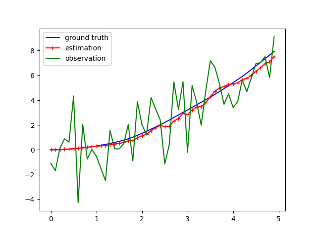

# prob_robotics_2025

## 概要
　2025年度の確率ロボティクスの講義で出題された課題に基づき作成したリポジトリ
  本リポジトリでは1次元空間でのカルマンフィルタを実装した
## 実行環境
  - Ubuntu 22.04LTS
  - Python 3.11.0

## インストール
    $ https://github.com/shouzaki978/prob_robotics_2025.git
    $ cd prob_robotics_2025

## アルゴリズム
  カルマンフィルタの数式によるアルゴリズムは次のJupyter Notebookに記述している

    $ kalmanfilter.ipynb

## kalmanfilter
   初期位置を 0 とし，1 次元空間を移動するロボットを想定し，
  制御入力（加速度）およびノイズを考慮した
  カルマンフィルタによる状態推定のシミュレーションを実装した．

  ロボットの状態は位置と速度からなる状態ベクトルとして定義し，
  位置のみがノイズを含んだ形で観測されるものとする．
  ノイズおよび観測ノイズはいずれもガウス分布に従うものとした．

  シミュレーション結果として，
  真の位置，観測値，およびカルマンフィルタによる推定結果を，
  時間と位置の 2 次元グラフとして出力する．

## 実行及び結果
  実行結果を示す. 例として, 刻み時間を0.1, 実行時間50まで,動作時のノイズを1.0, 観測時のセンサのノイズを2.0, 制御入力の加速度を0.5に設定して実行した. 実行時の出力を下図に示す. 横軸を時間, 縦軸を位置とし, 青線が真値, 緑船が観測値, 赤線がカルマンフィルタを用いて推定した位置を示している.

  

    $ python3 kalmanfilter.py

## 参考文献
  - 6-2章.pdf

  - 7-2章.pdf

  - ロボットの確率●統計- 製作・競技・知能研究で役立つ考え方と計算法 - (https://www.coronasha.co.jp/np/isbn/9784339046878/)

